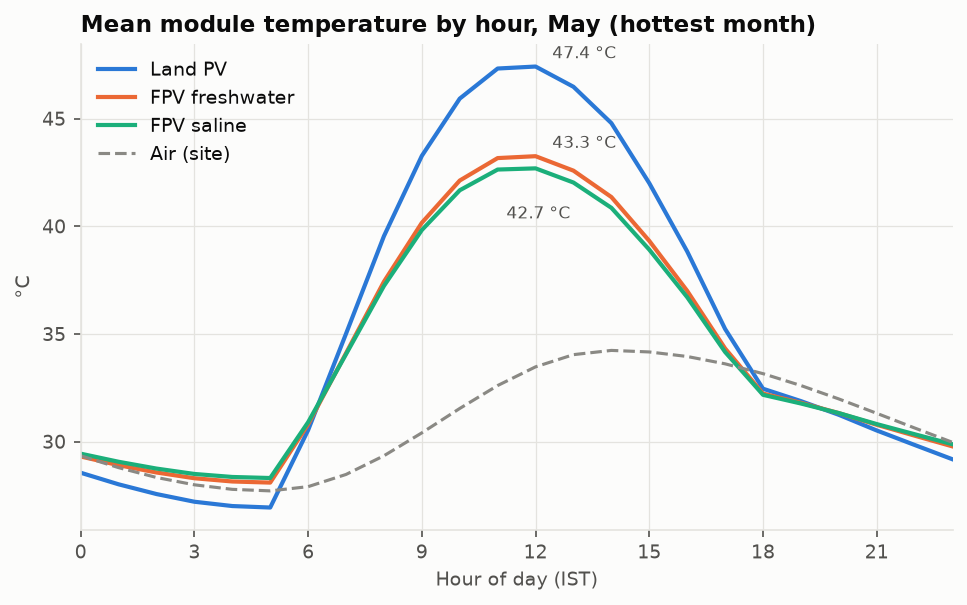
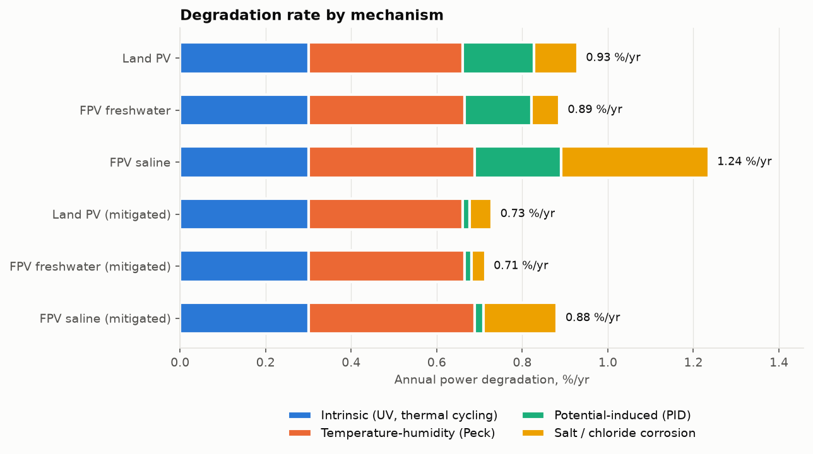

# Performance Analysis of Floating Solar PV Systems for Humid and Saline Conditions

An open, reproducible simulation framework that compares three 1 MWp plants in a hot, humid, coastal climate
(default site: Visakhapatnam, Andhra Pradesh, India):

| Key | System |
|---|---|
| `land` | Land-mounted PV near the coast (reference) |
| `fpv_fresh` | Floating PV on a freshwater reservoir |
| `fpv_saline` | Floating PV on saline / near-shore water (lagoon, salt pan, harbour) |

Each plant is also simulated with **PID-resistant, IEC 61701 salt-mist-certified modules** (`*_mitigated`).

The study looks at how water cooling, high humidity and sea salt act together on:

* **year-1 energy yield**: module temperature, spectrum, soiling, dew, DC/AC losses and availability;
* **long-term degradation**: temperature-humidity (Peck), potential-induced degradation (PID) and chloride corrosion;
* **25-year energy, LCOE** and the reservoir water saved by freshwater FPV.

The full generated report, with tables and figures, is in **[`results/REPORT.md`](results/REPORT.md)**.

## Headline results (synthetic Visakhapatnam year, seed 42)

| | Land PV | FPV freshwater | FPV saline |
|---|---|---|---|
| Specific yield, year 1 (kWh/kWp) | 1611 | **1636** | 1587 |
| Performance ratio | 0.821 | **0.838** | 0.813 |
| Mean daytime module temperature (°C) | 38.8 | 36.1 | 35.8 |
| Degradation (%/yr) | 0.93 | **0.89** | 1.24 |
| Degradation with mitigated modules (%/yr) | 0.73 | 0.71 | 0.88 |
| 25-year energy (MWh per MWp) | 36 093 | **36 838** | 34 313 |

Floating PV runs cooler and yields more. Over the life of the plant, though, the more humid air over the water and, at
saline sites, chloride corrosion and salt-assisted PID take back part or all of that gain. Module choice (PID-resistant,
IEC 61701 severity 6) is the main lever for saline sites.




## Quick start

```bash
pip install -r requirements.txt
python -m fpv_analysis                  # synthetic weather -> results/
python -m fpv_analysis --weather my_site.csv --out results_my_site
python -m pytest -q                     # 17 tests
```

A full run takes about 5 seconds and writes:

* `results/REPORT.md`: narrative report with every number recomputed;
* `results/summary.csv`: all KPIs for the six scenarios;
* `results/monthly.csv`, `results/lifetime_energy_mwh.csv`, `results/sensitivity_fpv_saline.csv`;
* `results/figures/*.png`: 9 figures (climate, module temperature, monthly energy, losses, soiling, degradation,
  lifetime energy, two humidity × salinity heatmaps).

### Using measured weather

Give an hourly CSV whose first column is a local-time timestamp, plus these columns:

| column | unit |
|---|---|
| `ghi` | W/m² |
| `temp_air` | °C |
| `rh` | % |
| `wind_speed` | m/s (at about 2-10 m) |
| `precip` | mm/h (optional, used for rain cleaning) |

NASA POWER, PVGIS TMY and IMD station data can all be converted to this format. To change the site coordinates, edit
`Site` in `fpv_analysis/config.py`.

### Using it as a library

```python
from dataclasses import replace
from fpv_analysis import default_scenarios, run_scenario, synthetic_weather

weather = synthetic_weather()
land, fresh, saline = default_scenarios()
sea = replace(saline, degradation=replace(saline.degradation, chloride_deposition=400.0))
print(run_scenario(weather, sea).kpis["deg_total_pct_yr"])
```

## Model chain

```
weather ──► microclimate over water ──► sun position ──► Erbs ──► Hay-Davies POA
   (T, RH, wind, rain)  (T→water, Td↑, wind↑, albedo)                         │
                                                                             ▼
          IAM ─► spectral (precipitable water) ─► soiling (dust+salt) ─► dew optical loss
                                                                             │
     Faiman module temperature ◄─────────────────────────────────────────────┤
                 │                                                           ▼
                 ├──► PVWatts DC ─► wiring/mismatch/motion/LID ─► inverter ─► availability ─► AC energy
                 ▼
     surface RH ─► encapsulant RH (48 h lag) ─► Peck  ┐
     daytime RH + salt film ──────────────────► PID   ├─► annual degradation ─► 25-yr energy ─► LCOE
     time of wetness × √chloride ─────────────► corrosion ┘
```

| Module | Contents |
|---|---|
| `config.py` | All parameters as dataclasses; the three default scenarios and the mitigated variant |
| `climate.py` | Synthetic typical-year generator, CSV loader, over-water microclimate |
| `solar.py` | Spencer geometry, Haurwitz clear sky, Erbs, Hay-Davies, ASHRAE IAM, Kasten-Young air mass, Gueymard precipitable water, First Solar spectral factor |
| `thermal.py` | Faiman model with night-sky loss, module-surface RH, dew with hysteresis |
| `soiling.py` | Daily dust/salt mass balance with tilt-dependent rain cleaning, NaCl deliquescence and scheduled cleaning |
| `electrical.py` | PVWatts DC and inverter models |
| `degradation.py` | Peck, PID and ISO 9223-style corrosion rates; lifetime energy |
| `economics.py` | LCOE, evaporation savings |
| `simulation.py` | Hourly chain, loss accounting, KPIs |
| `sensitivity.py` | Dew-point rise × salinity sweep |
| `plots.py`, `report.py`, `cli.py` | Figures, Markdown report, command line |

## Key parameters and sources

| Parameter | Land | FPV fresh | FPV saline | Basis |
|---|---|---|---|---|
| Faiman u0 / u1 (W/m²K, W/m³sK) | 25 / 6.84 | 35 / 8.0 | 35 / 8.0 | Faiman (2008); FPV heat-loss coefficients 31-57 W/m²K reported by Liu et al. (2018), Dörenkämper et al. (2021) |
| Tilt (°) | 15 | 12 | 12 | Typical pontoon systems |
| Albedo | 0.20 | 0.07 | 0.07 | Water surface |
| Dew-point rise over water (K) | 0 | 1.0 | 1.5 | Assumption |
| Dust / salt deposition (g/m²/day) | 0.15 / 0.015 | 0.04 / 0.010 | 0.03 / 0.060 | Assumption |
| Chloride deposition (mg/m²/day) | 30 | 8 | 180 | ISO 9223 S1-S2 classes |
| Wave-motion mismatch | 0 | 0.7 % | 1.0 % | Literature range 0.5-1.5 % |
| Availability | 99 % | 98.5 % | 98 % | Assumption |
| Peck Ea / n | 0.79 eV / 3 | | | Peck (1986) |
| PID Ea | 0.9 eV | | | Hacke et al. |
| CAPEX (INR/Wp) | 35 | 45 | 52 | Illustrative Indian market |

The degradation reference rates are calibrated so that a standard module on land in a hot-humid Indian climate loses
about 1 %/yr, which matches the order of magnitude in the All-India PV module surveys (NCPRE/NISE). **Measured data
should replace the assumptions wherever they exist.** Relative comparisons between scenarios are more robust than
absolute values.

### References

* Dörenkämper, M. et al. (2021). The cooling effect of floating PV in two different climate zones. *Solar Energy* 214, 239-247.
* Liu, H. et al. (2018). Field experience and performance analysis of floating PV technologies in the tropics. *Prog. Photovolt.* 26, 957-967.
* Faiman, D. (2008). Assessing the outdoor operating temperature of photovoltaic modules. *Prog. Photovolt.* 16, 307-315.
* Peck, D. S. (1986). Comprehensive model for humidity testing correlation. *IEEE IRPS*, 44-50.
* Hacke, P. et al. NREL studies of temperature and humidity acceleration of potential-induced degradation (PID).
* Erbs, D. G., Klein, S. A., Duffie, J. A. (1982). *Solar Energy* 28, 293-302.
* Hay, J. E., Davies, J. A. (1980). Calculation of the solar radiation incident on an inclined surface.
* Lee, M., Panchula, A. (2016). Spectral correction for photovoltaic module performance based on air mass and precipitable water. *IEEE PVSC*.
* Gueymard, C. (1994). Analysis of monthly average atmospheric precipitable water and turbidity in Canada and northern United States. *Solar Energy* 53, 57-71.
* ISO 9223:2012. Corrosion of metals and alloys - Corrosivity of atmospheres.
* IEC 61701:2020. Photovoltaic modules - Salt mist corrosion testing. IEC TS 62804-1 (PID).
* Dobos, A. P. (2014). PVWatts Version 5 Manual. NREL/TP-6A20-62641.
