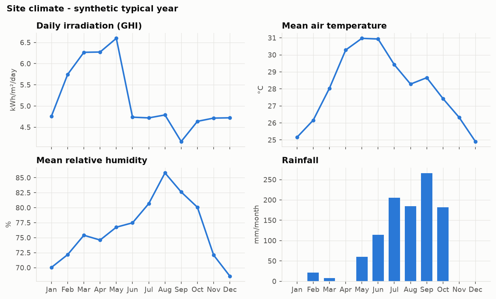
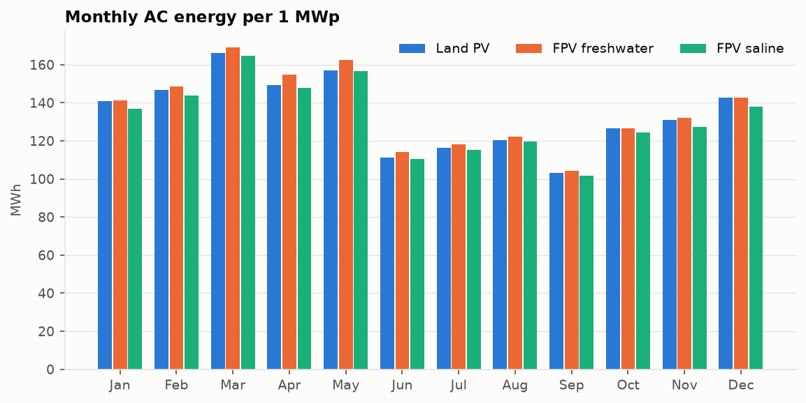
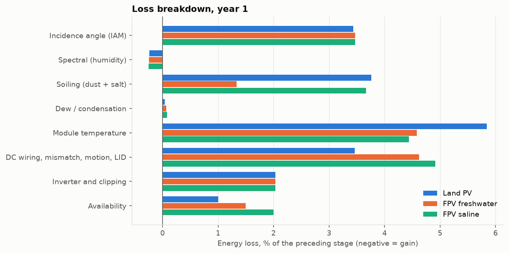
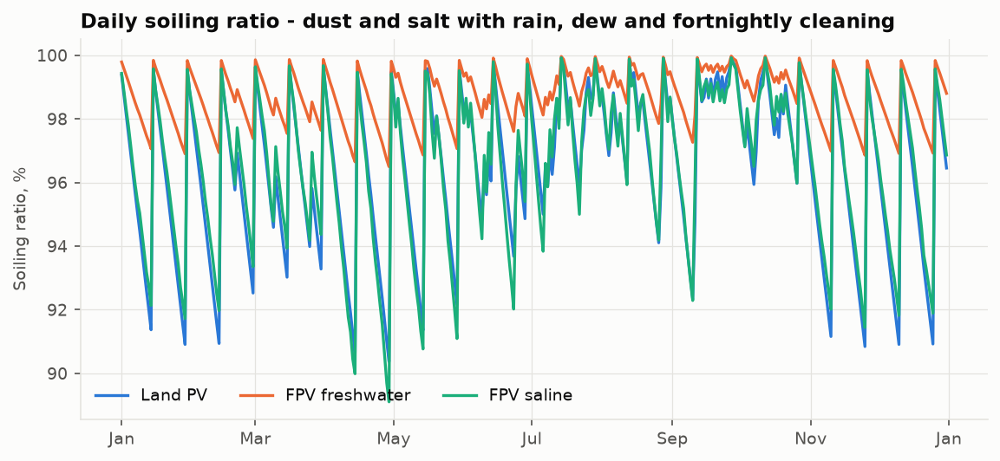
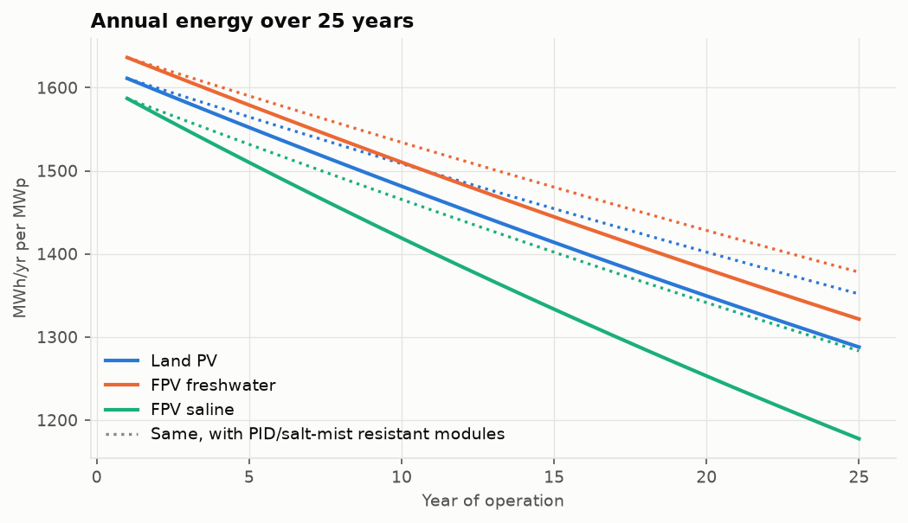
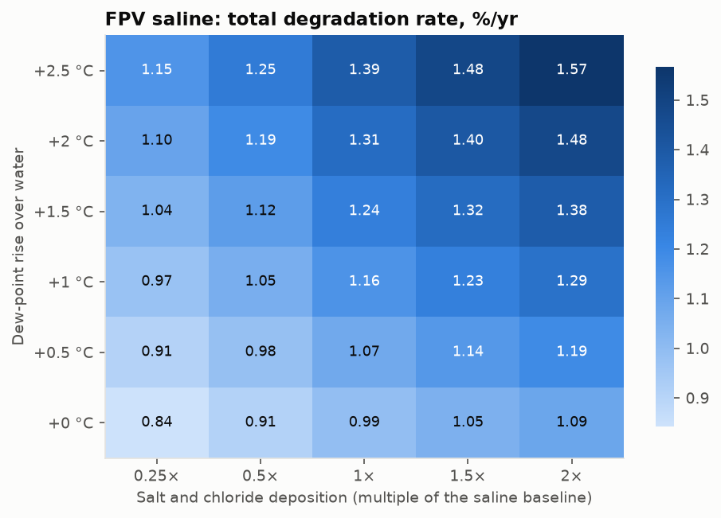
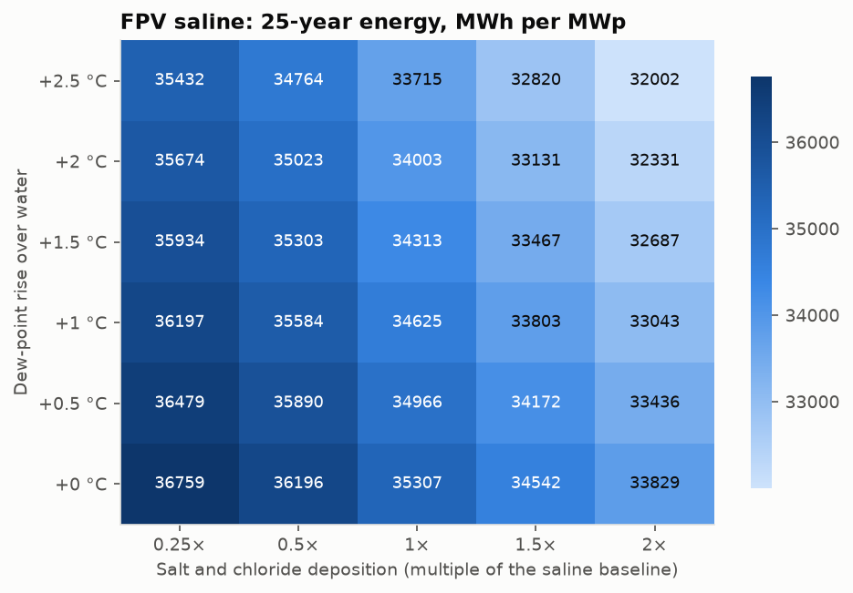

# Performance Analysis of a Floating Solar PV System for Humid and Saline Conditions

*Generated by `python -m fpv_analysis` - every number in this report is recomputed on each run.*

**Site:** Visakhapatnam, Andhra Pradesh, India (17.69° N, 83.22° E), hot, humid, coastal.
**Weather:** synthetic hourly year - GHI 1889 kWh/m², mean air
temperature 28.1 °C, mean RH 76.4 %, rainfall
1043 mm.
**Plant:** 1 MWp DC per scenario, DC/AC ratio 1.2, mono-PERC modules (−0.35 %/K), south facing.

## 1. Key findings

1. **Water cooling pays off.** Floating modules run 2.8 K
   cooler on average in daytime and 6.9 K cooler at peak than land-mounted
   modules. The temperature loss falls from 5.8 % to 4.6 %.
2. **Freshwater FPV gives the highest year-1 yield**: 1636 kWh/kWp, against
   1611 kWh/kWp on land (+1.6 %). PR is
   0.838 against 0.821. Lower soiling over water adds to the thermal gain. Extra
   cabling, wave-induced mismatch and lower availability take part of it back.
3. **Saline FPV loses the advantage.** Sea-salt deposits, cemented by deliquescence when the air is above 75 % RH, raise
   soiling to 3.7 %. Together with higher DC and availability losses, year-1 yield is
   1587 kWh/kWp (-1.5 % vs land).
4. **Humidity offsets the cooling benefit for degradation.** The air over water is more humid
   (80-82 % against 76 %), and cooler modules sit closer to the dew
   point. Encapsulant moisture therefore rises (66 % → 71 % →
   73 %). That offsets the Arrhenius benefit of the lower temperature: temperature-humidity
   degradation is 0.36 %/yr on land against 0.37 %/yr
   (freshwater) and 0.39 %/yr (saline).
5. **Chloride corrosion and PID drive the extra loss in saline water.** Time of wetness reaches 4967 h/yr.
   Total degradation is 1.24 %/yr against 0.93 %/yr on land and
   0.89 %/yr on freshwater. After 25 years a saline plant keeps 74.2 % of
   its capacity.
6. **Module choice is the main lever in saline sites.** PID-resistant, IEC 61701 severity-6 modules cut saline FPV degradation
   to 0.88 %/yr and raise 25-year energy by
   +4.2 % for an assumed +1.5 INR/Wp. LCOE goes from
   4.47 to 4.45 INR/kWh.
7. **Sensitivity.** Over the humidity × salinity grid, 25-year energy of the saline FPV ranges from
   32002 MWh (dew point +2.5 °C, 2× salt) to
   36759 MWh (+0 °C, 0.25× salt). Across the full
   ranges swept, salinity moves lifetime energy by about 3191 MWh and extra moisture by about 1580 MWh.
8. **Co-benefit.** The freshwater plant avoids about 11,700 m³/yr of reservoir evaporation per MWp
   and needs no land.

## 2. Methodology

| Step | Model | Humidity / salinity coupling |
|---|---|---|
| Weather | Synthetic typical year from monthly normals (AR(1) clearness, rain, sea-breeze wind) or user CSV | Dew point held per day, so RH has a realistic diurnal cycle |
| Microclimate over water | Air pulled towards 30-day water temperature; dew point raised; wind ×1.15-1.25; albedo 0.07 | More moisture and lower diurnal air-temperature amplitude |
| Sun and irradiance | Spencer geometry, Erbs decomposition, Hay-Davies transposition, ASHRAE IAM | - |
| Spectrum | First Solar mono-Si spectral factor (air mass, precipitable water from Gueymard 1994) | Humid air gives a small c-Si spectral gain |
| Module temperature | Faiman, land u0/u1 = 25/6.84, FPV 35/8.0 W/m²K; night-sky radiative loss | Cooler modules → more dew |
| Dew | Forms within 1 K of the dew point, dries 4 K above it; 4 % optical loss while wet | Time of wetness |
| Soiling | Daily dust + salt mass balance, rain cleaning scaled by tilt, NaCl deliquescence cementation, cleaning every 15 days | Salt crust and wet adhesion |
| DC/AC | PVWatts DC (−0.35 %/K), wiring, mismatch, FPV wave motion, LID, PVWatts inverter with clipping, availability | - |
| Degradation | Intrinsic + Peck (Ea 0.79 eV, n 3, lagged encapsulant RH) + PID (Ea 0.9 eV, surface leakage) + chloride corrosion (ISO 9223 TOW × √Cl) | All three humidity terms |
| Economics | LCOE with discounted CAPEX/OPEX over 25 years | Degradation enters through lifetime energy |

Parameters are in `fpv_analysis/config.py`; their sources and the assumptions are listed in `README.md`.

## 3. Site climate

## 4. Year-1 performance

| Metric | Land-mounted PV (coastal) | Floating PV (freshwater reservoir) | Floating PV (saline / near-shore) |
|---|---|---|---|
| Annual AC energy (MWh) | 1611.1 | 1636.2 | 1587.0 |
| Specific yield (kWh/kWp) | 1611 | 1636 | 1587 |
| Performance ratio | 0.821 | 0.838 | 0.813 |
| CUF, DC basis (%) | 18.39 | 18.68 | 18.12 |
| Plane-of-array irradiation (kWh/m²) | 1963 | 1953 | 1953 |
| Mean daytime module temperature (°C) | 38.8 | 36.1 | 35.8 |
| Maximum module temperature (°C) | 56.1 | 49.2 | 48.6 |
| Module - air, daytime mean (K) | 9.5 | 6.9 | 6.6 |
| Mean air RH at the array (%) | 76.4 | 80.0 | 82.1 |
| Hours with dew on the glass | 1533 | 1615 | 1879 |
| Mean daytime soiling ratio | 0.964 | 0.987 | 0.965 |

### Loss breakdown

| Loss stage (% of preceding stage) | Land-mounted PV (coastal) | Floating PV (freshwater reservoir) | Floating PV (saline / near-shore) |
|---|---|---|---|
| Incidence angle (IAM) | 3.44 | 3.47 | 3.47 |
| Spectral (humidity) | -0.24 | -0.24 | -0.25 |
| Soiling (dust + salt) | 3.76 | 1.34 | 3.67 |
| Dew / condensation | 0.04 | 0.07 | 0.08 |
| Module temperature | 5.84 | 4.58 | 4.44 |
| DC wiring, mismatch, motion, LID | 3.46 | 4.62 | 4.91 |
| Inverter and clipping | 2.03 | 2.03 | 2.04 |
| Availability | 1.00 | 1.50 | 2.00 |

## 5. Degradation, lifetime energy and cost

| Scenario | Intrinsic (%/yr) | Temperature-humidity, Peck (%/yr) | PID (%/yr) | Salt / chloride corrosion (%/yr) | **Total (%/yr)** | Time of wetness, ISO 9223 (h/yr) | Mean encapsulant RH (%) | Capacity in year 25 (%) | 25-year energy (MWh) | LCOE (INR/kWh, illustrative) |
|---|---|---|---|---|---|---|---|---|---|---|
| Land-mounted PV (coastal) | 0.30 | 0.36 | 0.17 | 0.10 | **0.93** | 3609 | 65.8 | 79.9 | 36093 | 2.84 |
| Floating PV (freshwater reservoir) | 0.30 | 0.37 | 0.16 | 0.06 | **0.89** | 4432 | 70.9 | 80.8 | 36838 | 3.55 |
| Floating PV (saline / near-shore) | 0.30 | 0.39 | 0.20 | 0.34 | **1.24** | 4967 | 72.9 | 74.2 | 34313 | 4.47 |
| Land-mounted PV (coastal) + PID/salt-mist resistant modules | 0.30 | 0.36 | 0.02 | 0.05 | **0.73** | 3609 | 65.8 | 83.9 | 36946 | 2.90 |
| Floating PV (freshwater reservoir) + PID/salt-mist resistant modules | 0.30 | 0.37 | 0.02 | 0.03 | **0.71** | 4432 | 70.9 | 84.2 | 37590 | 3.61 |
| Floating PV (saline / near-shore) + PID/salt-mist resistant modules | 0.30 | 0.39 | 0.02 | 0.17 | **0.88** | 4967 | 72.9 | 80.9 | 35750 | 4.45 |

## 6. Sensitivity to humidity and salinity (saline FPV)

The dew-point rise over water stands for extra humidity. Salinity scales salt soiling and chloride deposition together.

## 7. Recommendations for humid and saline sites

* Specify **PID-resistant modules** and **IEC 61701 severity 6 (salt mist)** and **IEC 62716 (ammonia)** certification. Use
  glass-glass modules with POE encapsulant where the budget allows, to limit moisture ingress.
* Use negative-pole grounding or night-time PID recovery on inverters. Choose IP68, marine-grade connectors and junction boxes.
* Use **HDPE floats, stainless steel 316 / hot-dip galvanised or aluminium fasteners**, and design to ISO 9223 class C5/CX at
  saline sites.
* Clean with demineralised water. At saline sites, tighten the cleaning interval in the dry season, when rain does not wash
  off the salt crust.
* Monitor module temperature, RH at the array, leakage current (insulation resistance) and soiling (reference cells) so that
  the model can be recalibrated with measured data.

## 8. Limitations

* The synthetic weather reproduces the monthly climatology, not a specific measured year. Use `--weather` with measured or TMY
  data for project-level estimates.
* The degradation reference rates are calibrated to field-survey magnitudes, not to measurements on this site. Relative
  comparisons are more robust than absolute values.
* Costs are illustrative Indian-market figures.
